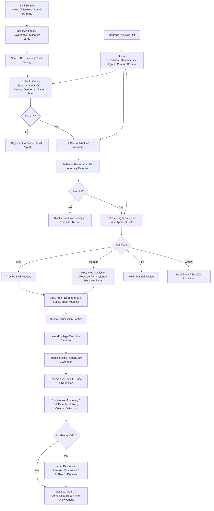

# SkillGate 架構與產品化筆記

更新時間：2026-03-15

## 目的
整理目前已討論的 SkillGate 架構、MVP 邊界、進階能力與商業化敘事，避免想法散落在聊天訊息裡。

---

## 一句定位
**SkillGate 是 AI agent skills 的上線安全門禁與執行治理層。**

它不是單純掃描 skill，而是在安裝前審查、執行前核准、執行中限制權限、執行後持續監控，讓團隊可以真正放心把 skills / plugins 接進 production workflow。

### 強版定位句
從 skill intake 到 runtime enforcement，SkillGate 把 agent skills 從「可下載」變成「可被信任、可被控制、可被稽核」。

### 商業版定位
- Agent 上線基礎設施
- Skill marketplace 的 trust layer
- 企業導入 agent automation 的門禁系統

---

## MVP 原則
先做 MVP，不先做大而全。

### MVP 先要證明的事
第三方 skill 在進 production 前，能被：
1. 審
2. 限權
3. 記錄

### MVP 要回答的 3 個問題
1. 這個 skill 能不能裝？
2. 如果能裝，要限制哪些權限？
3. 我們有沒有留下可稽核紀錄？

---

## 建議的 MVP 範圍（V1）

### 1. Skill Intake
- 上傳 / 輸入 skill source
- 填 metadata
- 記錄來源、版本、作者、授權

### 2. L1 Static Vetting
- 掃描危險 pattern
- 以 **skill-vetting** 作為第一層核心掃描引擎之一
- 補上 source metadata parsing、manifest / permission inspection、dependency / license inspection、risk summary generation
- 例如：
  - `curl` / `wget`
  - `exec` / `eval`
  - 讀 `.env`
  - 可疑外連
  - 動態下載執行

### 3. L2 Sandbox Runtime Check
- 在受限環境跑一次
- 觀察：
  - 是否偷讀敏感檔案
  - 是否亂打外網
  - 是否執行異常命令
  - 是否超出宣稱行為

### 4. Policy Gate
- 給出簡單決策：
  - allow
  - allow-with-restrictions
  - reject

### 5. Trusted Registry
- 保存審過的 skill 與版本
- 記錄：
  - hash
  - version
  - decision
  - risk notes
  - approved permissions

### 6. Audit Report
- 產出人類可讀報告
- 讓安全、技術、管理端都看得懂

---

## MVP 暫時不做
以下不應放進第一版交付：
- 來源信譽分數
- SkillGraph
- 自動 diff gate
- ML anomaly detection
- 自動 rollback / quarantine
- 多租戶權限系統
- 重 dashboard 導向 UI

### 原因
- 不是第一個能證明價值的點
- 會拖慢 build 與 demo
- 容易陷入功能膨脹

---

## MVP 最小流程

```text
Upload Skill
→ Static Vetting
→ Sandbox Run
→ Risk Summary
→ Policy Decision
→ Save to Registry
→ Export Audit Report
```

---

## 目前提出的進階能力

### 1. 信譽分析（Reputation Analysis）
在技能進入檢測流程前，先根據來源可信度、發布者歷史、社群訊號與已知風險指標做預篩，優先攔截高風險來源，降低後續分析成本。

### 關於 L1 與 skill-vetting 的關係
- **L1 Static Vetting 不是只等於 skill-vetting**
- 正確切法是：`skill-vetting` 作為 L1 的核心掃描引擎之一
- SkillGate 的產品價值在於把：
  - intake
  - L1 static vetting
  - L2 sandbox analysis
  - policy decision
  - trusted registry
  - audit report
  串成完整流程，而不是只包一個掃描器

#### 簡短 pitch 版
先篩掉高風險來源，避免垃圾進入主流程。

---

### 2. SkillGraph 供應鏈視圖（Supply-chain Visibility）
建立技能、依賴、授權與權限要求之間的關聯圖譜，讓安全團隊能追蹤風險傳播路徑；一旦依賴漏洞、授權異動或權限升級發生，立即觸發 Diff Gate 重新審核。

#### 簡短 pitch 版
把依賴、授權、權限變成可追蹤供應鏈視圖。

---

### 3. 行為指紋與 Drift 偵測（Behavior Fingerprinting & Drift Detection）
將安全控制延伸到運行階段，持續比對技能當前行為與既有基線；一旦出現偏離模式的存取、外連或執行特徵，系統可自動降權、隔離或要求重新審批。

#### 簡短 pitch 版
技能一旦行為變質，系統自動降權或隔離。

---

## 架構敘事總結句
**從「來源可信」到「依賴可見」再到「運行可控」的全生命週期防線。**

---

## 原始圖的三個關鍵缺口

### 1. 缺風險分級決策層
原本只有 pass / fail / manual review，不夠。

#### 應補風險分級
- low risk → 自動通過
- medium risk → 降權執行 + 加強監控
- high risk → 人工審批
- critical risk → 直接封鎖

#### 為什麼重要
沒有風險分級，系統太二元，營運效率差。

---

### 2. 缺 Identity / Trust / Signing
只有 source reputation 不夠。

#### 應補能力
- publisher identity verification
- skill signing / provenance attestation
- artifact hash / immutable version pinning

#### 為什麼重要
不然供應鏈安全講很大聲，但來源偽造或版本偷換就能直接穿透。

---

### 3. 缺執行後處置層
Observability 有了，但沒有 response loop。

#### 應補能力
- auto revoke skill
- quarantine running worker
- rollback to previous trusted version
- incident workflow / ticketing

#### 為什麼重要
沒有這層，監控只是看熱鬧，不是控制。

---

## 完整版架構圖（Mermaid）



---

## 為什麼完整版更像可賣產品
補完後，SkillGate 不只是：
- skill scanner

而是：
- AI skill supply-chain security platform
- runtime governance layer
- lifecycle control system

---

## 對外敘事建議：三層結構

### 1. Pre-ingestion Security
- source trust
- static vetting
- runtime detonation

### 2. Runtime Governance
- admission control
- least privilege
- continuous monitoring

### 3. Lifecycle Control
- diff gate
- drift detection
- revoke / rollback / re-review

這個切法比單純技術流程更適合：
- 對外簡報
- 投資人 deck
- landing page
- 白皮書 / docs

---

## 簡報版應保留的賣點詞
- provenance
- policy gate
- least privilege
- continuous monitoring
- rollback / revoke

---

## 產品分期建議

### V1 必做
- L1 static vetting
- L2 secure runtime analysis
- policy gate
- trusted registry
- least-privilege enforcement
- audit report

### V1.5 可加
- Diff Gate
- dependency / license tracking
- explainable findings
- 基礎 drift detection

### V2 願景
- source reputation scoring
- publisher trust network
- SkillGraph
- learned behavior baseline
- anomaly-driven auto downgrade / isolate

---

## 一句結論
SkillGate 的產品路線應該是：**先做能被 demo、能被採用、能被付費驗證的 MVP；再把供應鏈視圖、行為基線與自動處置補成企業級平台。**
